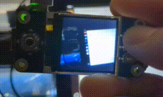

A simple camera:

https://www.waveshare.com/1.44inch-lcd-hat.htm

https://uk.pi-supply.com/products/raspberry-pi-camera-board-v1-3-5mp-1080p

https://www.raspberrypi.com/products/raspberry-pi-zero-w/

This is intended to be used as a < $50 input device in a fully-local/portable jetson-based ML inference pipeline.
